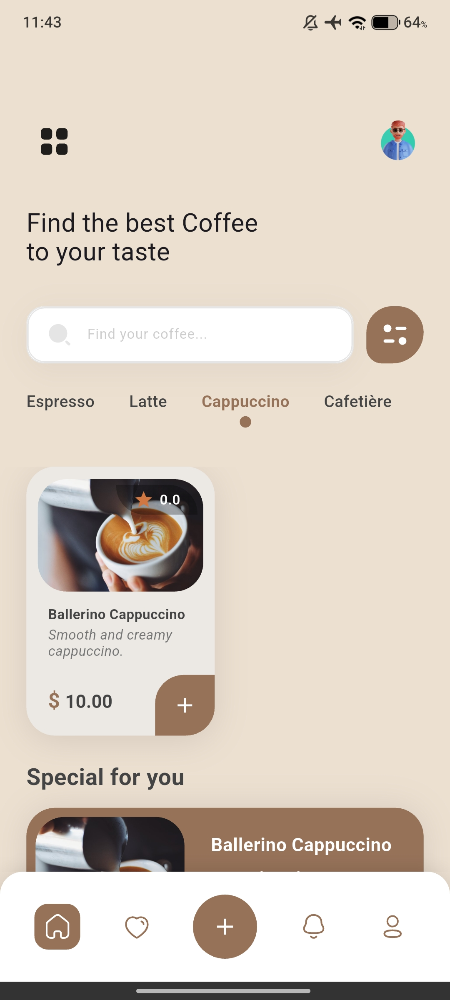
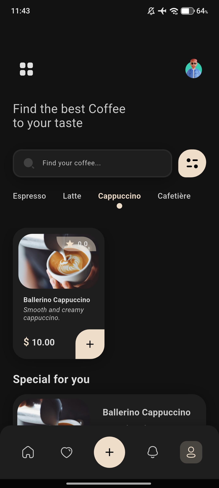
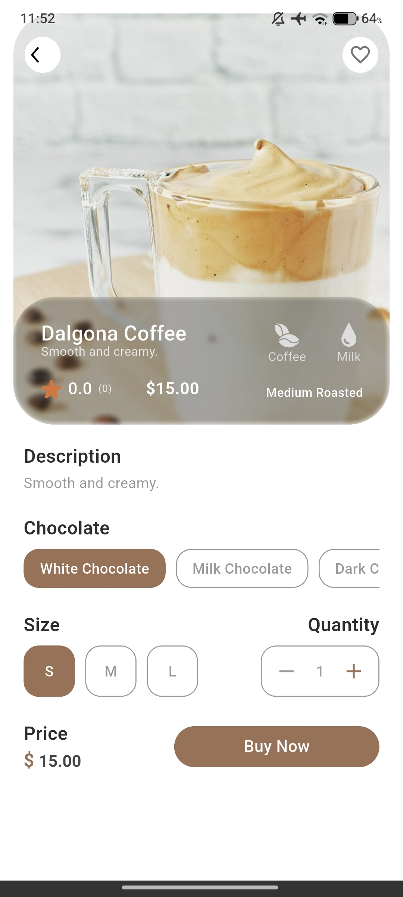

# ☕ Coffee App - Your Perfect Brew Companion

<div align="center">


**Stay Focused. Stay Caffeinated. Stay Productive.**

[](https://flutter.dev)
[](https://firebase.google.com)
[](LICENSE)

*Get the cup filled of your choice to stay focused and awake. Different types of coffee menu — hot latte, cappuccino, and more.*

</div>

---

## ✨ **What Makes This App Special?**

🎯 **Curated Coffee Selection** - Discover premium espresso, creamy lattes, rich cappuccinos, and artisanal cafetière brews  
🌙 **Beautiful Dark Mode** - Elegant light and dark themes that adapt to your preference  
❤️ **Smart Favorites** - Save your go-to drinks for quick access  
👤 **Personalized Experience** - Secure authentication with Google Sign-In support  
📱 **Responsive Design** - Perfectly crafted for any screen size  

---

## 🚀 **Features That Brew Excellence**

### 🔐 **Seamless Authentication**
- **Firebase Authentication** with email/password
- **Google Sign-In** for quick access
- **Session Management** - Stay logged in across app restarts
- **Welcome Back Messages** for returning users

### ☕ **Coffee Discovery**
- **4 Premium Categories**: Espresso, Latte, Cappuccino, Cafetière
- **Detailed Product Views** with rich descriptions
- **Smart Text Sizing** that adapts to content length
- **Expandable Descriptions** with "Read More" functionality

### 🎨 **Beautiful UI/UX**
- **Material Design 3** principles
- **Custom Dark Theme** with purple and teal accents
- **Smooth Animations** and transitions
- **Responsive Typography** that scales beautifully

### 📊 **State Management**
- **BLoC Architecture** for predictable state management
- **Real-time Updates** with Firebase Firestore
- **Offline-Ready** session persistence

---

## 🛠️ **Tech Stack**

| Technology | Purpose | Version |
|------------|---------|---------|
| **Flutter** | Cross-platform framework | 3.5.4+ |
| **Firebase Auth** | User authentication | 5.3.1 |
| **Cloud Firestore** | Real-time database | 5.4.1 |
| **BLoC Pattern** | State management | 8.1.6 |
| **SharedPreferences** | Local storage | 2.2.3 |
| **Google Sign-In** | OAuth authentication | 6.2.1 |

---

## 📱 **Screenshots**

<div align="center">

| Light Mode | Dark Mode | Product Details |
|------------|-----------|-----------------|
|  |  |  |

</div>

---

## 🚀 **Quick Start**

### **Prerequisites**
- Flutter SDK 3.5.4+
- Android Studio / VS Code
- Firebase project setup

### **Installation**

1. **Clone the repository**
   ```bash
   git clone https://github.com/yourusername/flutter_coffee_app.git
   cd flutter_coffee_app